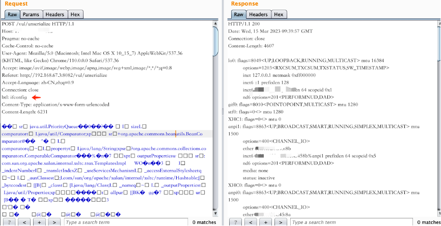

# ysoserialbtl

用法与原生ysoserial完全一致，原生ysoserial生成的payload只能实现命令执行的效果，不能输出命令执行的结果，不能生成内存马。

ysoserialbtl针对原生的CommonBeanutils1等链，新增了回显与内存马实现的思路。

1. CommonBeanutils1Echo,  回显命令执行的输出结果。

​	利用方式是在header中增加btl，用于输入命令。

2. CommonBeanutils1TomcatMemshell

   利用方式是使用冰蝎进行链接/btltest，密码是123，增加header头X-Options-Bi: xxx，值可以随意

   

3. CommonBeanutils1SpringMemshell

   利用方式是使用冰蝎进行链接/xxx（任意地址），密码是123，增加header头X-Options-Bi: xxx，值可以随意
